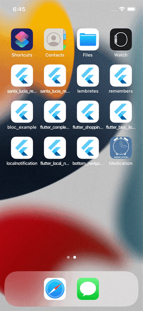

# Medication App

Medication App is a Flutter project that helps you reminder all the medication throughout the day by notifying you.

This app has **5 pages**:
* **Home** - here you will see a calendar with all the medication and if you already took the pill in the last days
* **Add Medicament** - here you can add a medicament and set the hours in order to be remembered
* **Medicaments List** - has all the medication that you are taking
* **Settings** - where you can set the Snooze Time (in minutes) of the medication
* **Did you take the medication** - this page appears because a notification was received, and it asks if you took that medicament at that hour

## What is used
### Localization

This project generates localized messages based on arb files found in
the `lib/localization` directory.

Right now, the languages used are the english and the portuguese.

To support additional languages, please visit the tutorial on
[Internationalizing Flutter
apps](https://flutter.dev/docs/development/accessibility-and-localization/internationalization)

### State Management

In order to manage the state inside this app is used the [flutter_bloc](https://pub.dev/packages/flutter_bloc).

### Data Base

To save the medication, it was used [hive](https://pub.dev/packages/hive).

### Flutter Local Notifications

To notify the user that he needs to take the medication it is used the [flutter_local_notifications](https://pub.dev/packages/flutter_local_notifications).

## Quick overview

## Next steps
* Give a clear view to the user if he took that specific medicament by just add a check or a cross Icon next to the description
* If you get the notification but you delete it you will never have a change to see the **Did you take the medication** screen,
so the idea is to add the possibility to the user to click on the medicament and open this screen
* Give to the user the possibility to take a medicament X times per day